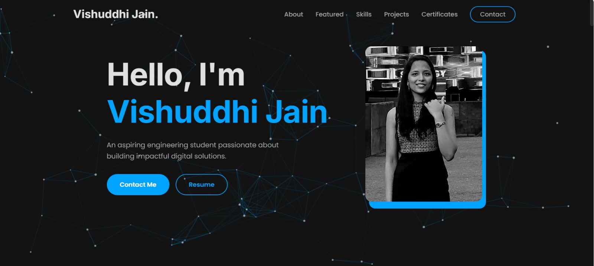

# Professional Portfolio

<div align="center">

  
  
  
  
  
  

</div>

---

A personal portfolio website built with **HTML, CSS, and JavaScript** to showcase my projects, skills, achievements, and experiences.

**Live Demo**:  
https://portfolio-gykryjp6v-vishuddhis-projects.vercel.app/

---

## Preview

<p align="center">
  
</p>

---

## Features

* **Interactive Particle Background**  
  Animated particle background powered by **tsParticles**, responsive to mouse movement.

* **Fluid Cursor Trail**  
  Custom snake-like animated cursor trail built with **GSAP**.

* **Dynamic Content Loading**  
  Projects, skills, and certificates loaded dynamically using JavaScript modules.

* **Smooth Scroll Animations**  
  Scroll-triggered fade-ins, sliders, and interactive transitions using **GSAP**.

* **Fully Responsive Design**  
  Optimized for mobile, tablet, and desktop devices.

* **Modern Modal Popups**  
  Clean modal system for certificates and project previews.

---

## Technologies Used

### Frontend
* HTML5
* CSS3
* JavaScript (ES6 Modules)

### Animation & Effects
* [GSAP (GreenSock Animation Platform)](https://greensock.com/gsap/)
* [tsParticles](https://particles.js.org/)

### UI & Assets
* [Devicon](https://devicon.dev/)
* [Google Fonts](https://fonts.google.com/) (Poppins & Inter)

## Local Setup

Clone and run locally:

```bash
# Clone the repository
git clone https://github.com/your-username/your-repo-name.git

# Navigate to the project directory
cd your-repo-name

# Open index.html in your browser
````

---

## About

This portfolio was built with attention to performance, animation smoothness, and modern UI design principles.

It reflects my interest in:

* Frontend Engineering
* Interactive Web Experiences
* Performance Optimization
* UI/UX Design

---

<p align="center">
  Built with ❤️ by Vishuddhi Jain  
</p>
